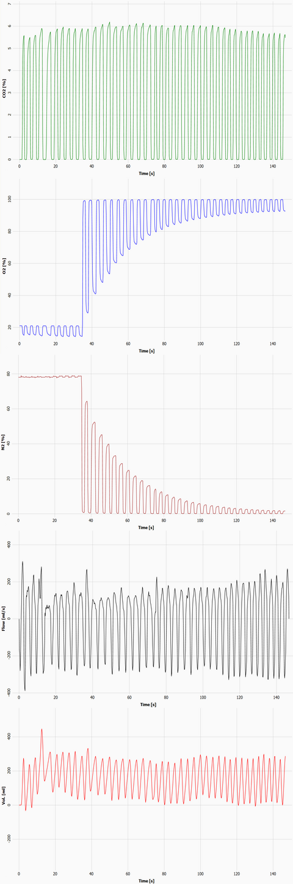
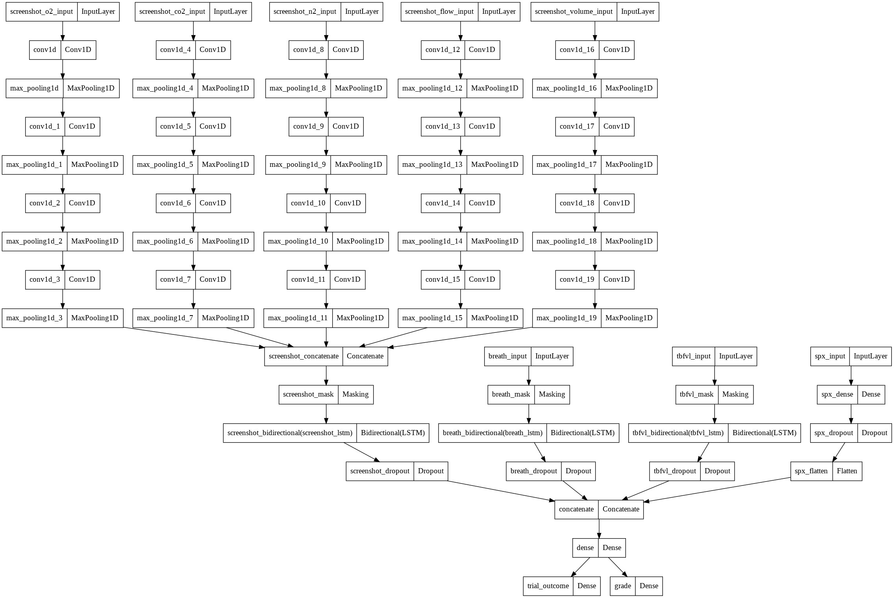

# Multiple Breath Washout Deep Learning Classification
## Project Organization Summary
    ├── README.md
    ├── requirements.txt
    ├── data
    │   ├── external
    │   │   ├── Primary Training Data Set
    │   │   └── Raw REDCap QC
    │   ├── intermediary
    │   │   ├── combine_data_type
    │   │   ├── interpolated_screenshots
    │   │   └── main_id_associated_files.csv
    │   ├── processed
    │   │   ├── test
    │   │   ├── train
    │   │   └── validate
    │   └── raw
    │       ├── digitize_screenshots
    │       ├── digitize_screenshots_manual
    │       ├── spiroware_screenshots
    │       ├── spiroware_screenshots_manual
    │       └── spx_exports
    ├── mbw_qc
    │   ├── data
    │   │   ├── assets
    │   │   ├── 1-spiroware_screenshot.py
    │   │   ├── 2-confirm_screenshot.py
    │   │   ├── 3-digitize_screenshot
    │   │   └── helper_mouse_location.py
    │   └── modified_packages
    │       └── plotdigitizer
    ├── models
    │   ├── baseline_BO
    │   │   ├── checkpoints
    │   │   ├── final_model
    │   │   └── tuner
    │   └── modified_packages
    │       └── plotdigitizer
    ├── notebooks
    │   ├── assets
    │   │   ├── digitize_example.png
    │   │   ├── mbw_example.png
    │   │   ├── model.png
    │   │   └── spiroware_screenshots.mp4
    │   └── model_training_overview.ipynb
    └── references
        └── MBWN2-Training-and-Qualification-Requirements_Aug-30-2017.pdf
* File structure is truncated for brevity

## Description
The lung clearance index (LCI), a ratio of the cumulative expired volume to the functional residual capacity, has been proposed as an alternative metric to the current spirometry paradigm. The LCI is obtained through the multiple breath inert gas washout (MBW). The North American, European, and Australian MBW central over-reading centres (CORCs) exist to formally review the MBW data. The raw MBW signals (Figure 1; CO2, O2, N2, flow, volume), along with the breath, and tidal breathing flow-loop are inspected to determine if the trial had all of the following:
- No leaks
- No coughing, laughing or talking
- No signal misalignment
- Adequate time between trials
- Clear end of test
- No abnormal tidal breathing patterns  

  

  Figure 1. Example of raw multiple breath inert gas washout signals. From top to bottom, CO2, O2, N2, flow, volume.

This project outlines the creation of a TensorFlow neural network used to classify an MBW trial as acceptable or rejected. The specifics of how the model was created is available in the [project notebook](notebooks/model_training_overview.ipynb). An executive summary of the methodology is presented below.

Note: The Ratjen lab has been gracious enough to let me publish this code on the condition that I do not include any data.

## Executive Summary
Model features, including raw MBW signals (CO2, O2, N2, flow, volume), breath tables, tidal breathing flow-volume loop tables, and spx summary tables, were obtained from 1439 individuals and totaled 13178 trials. The primary model label was trial outcome ('accept' or 'reject') with trial grades ('A', 'B', 'C', 'D', 'E', 'F', 'N/A') as a secondary outcome, where a trial grade of 'A', 'B', or 'C' correspond to an 'accept' outcome. Raw signals were digitized using a Python script which integrated Tesseract OCR while all other data was previously obtained during original study analysis. Data was split into a train (\~75%), validation (\~12.5%), and test (\~12.5%) data set by randomly grouping subject ID's to ensure no subject overlap between sets. Model feature data preprocessing included standardization, interpolation, and padding, if necessary. An additional boolean column was created to correspond to missing values. Data was converted to TFRecord due to memory constraints.

The TensorFlow model architecture included a multi-head CNN-LSTM (Figure 2) component combined with LSTM and Dense layers. Model hyperparameters were tuned using the Bayesian optimization option from the Keras tuner. The model was scheduled to be retrained for 25 epochs with the selected hyperparameters; however, the final model corresponds to the 7th epoch as training stopped early due to the loss associated with the validation grade label no longer decreasing.

  

  Figure 2. Architecture of TensorFlow model.

The resulting model metrics are presented in the table below.

|      Label      | Train Accuracy | Validation Accuracy | Test Accuracy |
|-----------------|----------------|---------------------|---------------|
|  Trial outcome  |  85.63%        | 82.54%              | 84.22%        |
|  Grade          |  69.19%        | 62.62%              | 65.38%        |

## Technologies
Project is created with:
* Python version: 3.9.0
    * Tensorflow/Keras (TFRecord, KerasTuner), pandas, numpy, pyautogui, pytesseract, OpenCV, plotdigitizer
* [Tesseract](https://tesseract-ocr.github.io/tessdoc/Downloads.html)
* Ecomedics Spiroware: 3.2.1

## Requirements
* [Python](https://www.python.org/)
* pip
* Windows 10

## Contact
* Information about the [Ratjen lab](https://lab.research.sickkids.ca/ratjen/) and the [MBW Centre](https://lab.research.sickkids.ca/ratjen/mbw-centre/) can be found on their website.

## Acknowledgements
This project would not be possible if not for the MBW overreaders at CORC who labelled the MBW.